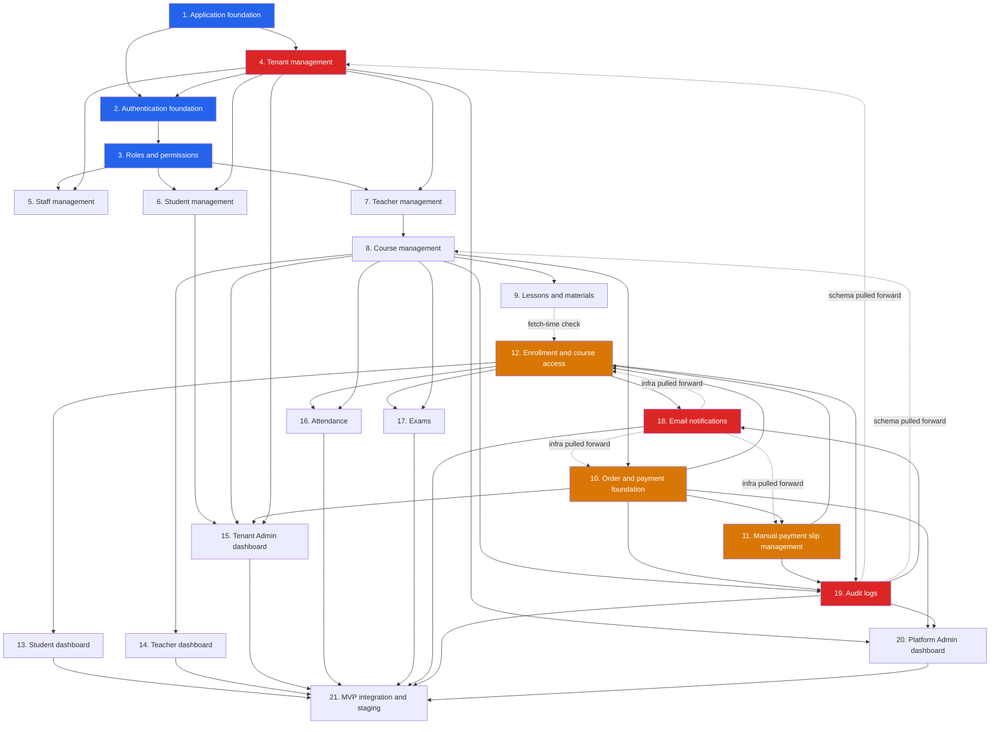

# MVP Dependency Map

Companion to `docs/planning/product-backlog.md` (per-story "Dependencies" field, the source of
truth) and `docs/planning/mvp-release-plan.md` (the wave sequencing derived from this map). This
document is the visual/aggregate view: a module-level graph, the specific story-level dependencies
that run *against* the 1–21 numbering (the ones that forced the release plan's reordering), and a
compact per-story lookup table.

## Module-level dependency graph

Blue = Wave 0 platform bedrock. Red = modules with content pulled forward ahead of their own literal
position (tenant management's resolution piece, audit schema, notification infrastructure). Orange
= Wave 3, the highest-risk payment/slip/enrollment cluster. Dotted arrows mark the "pulled forward"
relationships that break simple numeric ordering — see the table below for exactly which stories.

## Forward references (dependencies that run against the 1–21 module numbering)

These are the specific story-level dependencies that the architecture review found running
*backward* against the module numbering — an earlier-numbered module's story depends on a
later-numbered module's story. Each is why the release plan reorders into waves instead of
following module order literally.

| Depending story (earlier module #) | Depends on (later module #) | Why | Resolution in the release plan |
|---|---|---|---|
| `AUTH-1` (Module 2) | `TEN-1`, `TEN-3` (Module 4) | Login must resolve tenant identity from the subdomain before it can check tenant-scoped credentials. | `TEN-1`/`TEN-3` pulled into Wave 0 alongside Module 2. |
| `RBAC-1`'s minimal role claim (Module 3) | `AUTH-1` (Module 2) | The JWT `role` claim needs a role value before RBAC-1's full model is due — mild circularity, not a hard block. | Ship a minimal enum with `AUTH-1`; `RBAC-1` formalizes it in the same wave. |
| `TCH-2` (Module 7) | `CRS-3` (Module 8) | "My Courses" has nothing to display without the course-teacher assignment `CRS-3` produces. | `CRS-3` sequenced before `TCH-2` within Wave 2. |
| `MAT-3` (Module 9) | `ENR-1` (Module 12) | Fetch-time material visibility enforcement needs real enrollment/access state, which doesn't exist until three modules later. | `MAT-3` ships with an interim access check in Wave 2, fully re-enabled in Wave 3 once `ENR-1` lands. |
| `PAY-2` (Module 10) | `ENR-1` (Module 12) | Payment confirmation and enrollment activation must commit in one transaction — `PAY-2` can't reach Definition of Done without `enrollment-management`'s activation `api`. | `ENR-1`'s `api` contract designed concurrently with `PAY-2`, not after; both in Wave 3. |
| `SLIP-3` (Module 11) | `ENR-1` (Module 12) | Same atomic-transaction requirement as `PAY-2`. | Same Wave 3 treatment. |
| `SLIP-4` (Module 11) | `AUDIT-1` (Module 19) | The override-with-no-reason rejection is defined as happening in the same transaction as the audit write — this cannot be stubbed. **Sharpest forward-dependency in the backlog.** | `AUDIT-1`'s schema pulled into Wave 1, far ahead of Module 19's literal position. |
| `TEN-2` (Module 4) | `AUDIT-1` (Module 19) | Approval/status-change is spec-required to be audit-logged (though not on `security.md`'s canonical list). | `AUDIT-1` schema in Wave 1, before `TEN-2`. |
| `CRS-2` (Module 8) | `AUDIT-1` (Module 19) | Price-change is a canonical mandatory-audit action. | Same — `AUDIT-1` schema available by Wave 2. |
| `PAY-2`/`PAY-4` (Module 10), `ENR-2`/`ENR-3` (Module 12) | `AUDIT-1` (Module 19) | Payment approvals/rejections, refunds, access-extensions, and reactivation-approvals are all canonical mandatory-audit actions. | Same. |
| Nearly every Module 10–17 story's async side effect | `NOTIF-1` (Module 18) | Payment, slip, enrollment, and exam-result notifications are all specified as async, tenant_id-carrying dispatch — the infrastructure doesn't exist at Module 18's literal position. | `NOTIF-1` infrastructure pulled into Wave 1. |

## Per-story compact dependency table

For the full narrative dependency explanation per story, see `docs/planning/product-backlog.md`
field 5. This table is a quick-reference index only.

| Story | Hard blockers | Story | Hard blockers |
|---|---|---|---|
| APP-1 | None | ATT-1 | CRS-1, TCH-2, ENR-1 |
| APP-2 | None | ATT-2 | ATT-1 |
| APP-3 | APP-1, APP-2 (soft) | EXM-1 | CRS-1, TCH-1 |
| APP-4 | APP-1 | EXM-2 | EXM-1 |
| AUTH-1 | APP-1, APP-4, AUTH-3, TEN-1, TEN-3 | EXM-3 | EXM-2, ENR-1 |
| AUTH-2 | AUTH-1, APP-4 | EXM-4 | EXM-3 |
| AUTH-3 | APP-1 | EXM-5 | EXM-4, EXM-3 |
| RBAC-1 | APP-1, APP-4 | NOTIF-1 | APP-1 |
| RBAC-2 | RBAC-1, AUTH-2 | NOTIF-2 | NOTIF-1 |
| RBAC-3 | RBAC-2, APP-2 | AUDIT-1 | APP-1, APP-4 |
| TEN-1 | APP-1, APP-4 | AUDIT-2 | AUDIT-1 + every source domain's event contract |
| TEN-2 | TEN-1, AUTH-1/2, RBAC-2; soft: AUDIT-1/2 | AUDIT-3 | AUDIT-2, RBAC-2 |
| TEN-3 | TEN-1 | PADASH-1 | TEN-2, AUTH-1/2, RBAC-2 |
| STAFF-1 | TEN-1/2, AUTH-1/2, RBAC-1/2 | PADASH-2 | PAY-3, AUDIT-2/3 |
| STAFF-2 | STAFF-1; soft: AUDIT-1/2, NOTIF-1/2 | INTG-1 | Modules 1–20 substantially complete |
| STU-1 | TEN-1/3, APP-4 | INTG-2 | APP-3, INTG-1 |
| STU-2 | STU-1, RBAC-2 | INTG-3 | INTG-2 |
| STU-3 | STU-1; soft: ENR-1, PAY-3, ATT-1, EXM-3/5 | | |
| TCH-1 | TEN-1/3, AUTH-1, RBAC-1/2 | | |
| TCH-2 | TCH-1; hard (forward ref): CRS-3 | | |
| CRS-1 | TCH-1, TEN-1 | | |
| CRS-2 | CRS-1; soft: AUDIT-1/2 | | |
| CRS-3 | CRS-1, TCH-1 | | |
| CRS-4 | CRS-2, TEN-3 | | |
| MAT-1 | CRS-1 | | |
| MAT-2 | MAT-1 | | |
| MAT-3 | MAT-2; hard (forward ref): ENR-1 | | |
| PAY-1 | CRS-1/4, AUTH-1, APP-4 | | |
| PAY-2 | PAY-1; hard (forward ref): ENR-1 | | |
| PAY-3 | PAY-1, PAY-2 (or SLIP-3) | | |
| PAY-4 | PAY-2/3; soft: AUDIT-1/2 | | |
| SLIP-1 | PAY-1 | | |
| SLIP-2 | SLIP-1 | | |
| SLIP-3 | SLIP-2, RBAC-2; hard (forward ref): ENR-1 | | |
| SLIP-4 | SLIP-3; hard (forward ref): AUDIT-1 | | |
| ENR-1 | PAY-1 (designed alongside PAY-2/SLIP-3) | | |
| ENR-2 | ENR-1 | | |
| ENR-3 | ENR-2, PAY-1; soft: AUDIT-1/2 | | |
| SDASH-1 | AUTH-2, ENR-1 | | |
| SDASH-2 | ENR-1, ENR-2, CRS-1 | | |
| TDASH-1 | AUTH-2, TCH-2 | | |
| TDASH-2 | TCH-2 | | |
| TADASH-1 | soft: STU-1, CRS-1, PAY-3, TEN-1 | | |
| TADASH-2 | APP-2; soft: STAFF-1, STU-1, TCH-1, CRS-1, PAY-3 | | |

## Reading this map

- **Wave 0 (blue)** is a strict prerequisite for everything — no story outside Modules 1–3 (plus
  the pulled-forward `TEN-1`/`TEN-3`) can start before it completes.
- **The red pull-forwards (`AUDIT-1` schema, `NOTIF-1` infrastructure, `TEN-2`)** exist because six
  separate later stories independently need them — pulling them forward once is cheaper than each
  dependent story retrofitting its own ad hoc version.
- **The orange cluster (Modules 10–12)** is where `PAY-2`, `SLIP-3`, and `ENR-1` must be designed
  and built as one coordinated slice, not three sequential modules — see risk register items 1–5
  for what goes wrong if this coupling is treated as optional.
- Everything downstream of Wave 3 (dashboards, attendance, exams, notification/audit completion,
  Platform Admin, integration) follows the module numbering reasonably well and needed no
  reordering beyond `STU-3`'s history-view completion timing.
